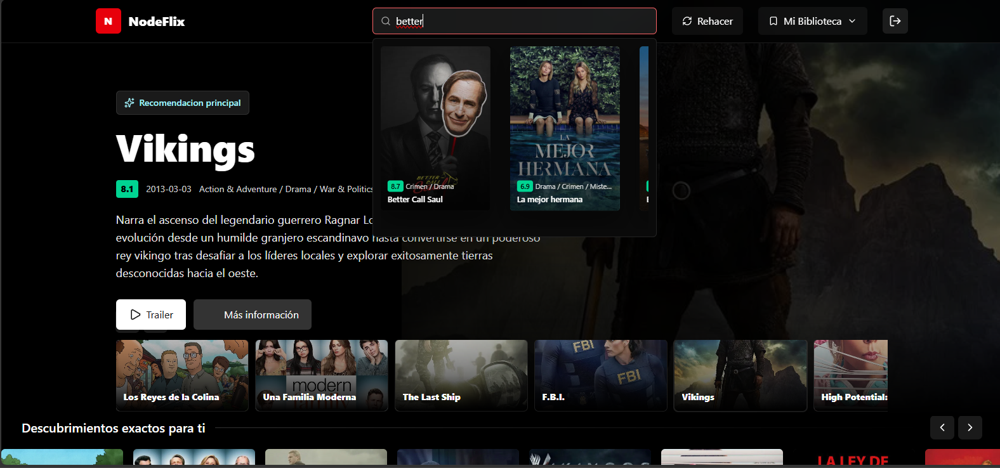

# Sergio Eduardo Tepaz Vela — Portafolio personal

Portafolio bilingüe de Sergio Eduardo Tepaz Vela, programador junior y estudiante de Ingeniería en Ciencias de la Computación y Tecnologías de la Información en la Universidad del Valle de Guatemala.

El sitio presenta experiencia profesional, proyectos de software, conocimientos técnicos, certificaciones verificadas, reconocimientos académicos y medios de contacto.



## Características

- Interfaz disponible en español e inglés.
- Temas claro y oscuro con preferencia persistente.
- Diseño bento responsivo para escritorio y dispositivos móviles.
- Navegación inspirada en un explorador de archivos.
- CV descargable en PDF.
- Galería de proyectos con repositorios de frontend y backend.
- Visualizador integrado de certificados y diplomas.
- Enlaces directos a correo, GitHub, LinkedIn y WhatsApp.

## Perfil

Sergio cuenta con formación técnica como Perito en Informática y actualmente estudia Ingeniería en Ciencias de la Computación y Tecnologías de la Información en la UVG. Sus áreas de interés incluyen desarrollo web, bases de datos y despliegue de aplicaciones en la nube.

### Experiencia

**Forza Delivery Express — Practicante profesional**  
Agosto de 2024 a octubre de 2024.

- Soporte técnico para aplicaciones internas.
- Desarrollo de una API REST con .NET para gestión de inventarios.
- Diseño de bases de datos relacionales con SQL Server.
- Implementación de interfaces administrativas con Angular.

## Proyectos

| Proyecto | Año | Tecnologías principales | Repositorios |
|---|---:|---|---|
| Nodeflix | 2026 | Angular, Node.js, Neo4j, TypeScript, TMDB API | [Frontend](https://github.com/stepaz-2022164/nodeflix-front) · [Backend](https://github.com/stepaz-2022164/nodeflix-back) |
| Bitcoin Script Interpreter | 2026 | Java, Maven, Bitcoin Script, criptografía | [Código](https://github.com/stepaz-2022164/BitcoinProject) |
| Gestor de Notas | 2025 | Python, Flask, MongoDB, HTML, CSS | [Código](https://github.com/stepaz-2022164/GestorNotas) |
| InventarioTEC | 2024 | Angular, TypeScript, C#, .NET 8, SQL Server | [Frontend](https://github.com/stepaz-2022164/InventarioTEC-front) · [Backend](https://github.com/stepaz-2022164/InventarioTEC-back) |
| Banca en Línea | 2024 | React, Vite, Node.js, JWT, Tailwind CSS | [Backend](https://github.com/Chejinos-Kinal/online-bank-backend) |
| UVG Canvas Dashboard | 2025 | Java, Spring Boot, Maven, Canvas LMS API | [Código](https://github.com/bcastillo-2022474/uvg-dashboard-canvas) |

Nodeflix es el proyecto destacado actual. Utiliza una base de datos orientada a grafos y un algoritmo de random walk para generar recomendaciones personalizadas de películas y series.

## Conocimientos técnicos

- **Lenguajes y fundamentos:** JavaScript, TypeScript, Python, C#, HTML y CSS.
- **Frameworks y entornos:** React, Angular, Node.js, Flask y .NET.
- **Bases de datos:** SQL Server, MySQL, MongoDB, Firebase y Firestore.
- **Nube:** Google Cloud, Cloud Run, IAM y gsutil.

## Certificaciones y reconocimientos

- Diploma de Estudiante Distinguido — Universidad del Valle de Guatemala, 2026.
- Diploma a la Excelencia Académica — Fundación Juan Bautista Gutiérrez, 2026.
- Beca Isabel Gutiérrez de Bosch — Fundación Juan Bautista Gutiérrez, 2024.
- Desarrollo de Aplicaciones para Android — INTECAP, 2022.
- Programación PHP y Conexión a Bases de Datos — INTECAP, 2022.
- MySQL para Principiantes — INTECAP, 2021.
- Microsoft Excel Intermedio — INTECAP, 2022.

## Tecnologías del portafolio

| Capa | Tecnología |
|---|---|
| Framework | Next.js 16 con App Router |
| Interfaz | React 19 |
| Lenguaje | TypeScript |
| Estilos | Tailwind CSS 4 y CSS personalizado |
| Animaciones | Framer Motion y GSAP |
| Componentes auxiliares | clsx y tailwind-merge |

## Ejecución local

### Requisitos

- Node.js 20.9 o superior.
- npm.

### Instalación

```bash
npm install
```

### Desarrollo

```bash
npm run dev
```

Abre [http://localhost:3000](http://localhost:3000) en el navegador.

### Compilación de producción

```bash
npm run build
npm run start
```

## Rutas

| Ruta | Contenido |
|---|---|
| `/` | Presentación, stack resumido, proyecto destacado, experiencia y contacto |
| `/projects` | Galería completa de proyectos |
| `/stack` | Conocimientos técnicos detallados |
| `/certifications` | Certificaciones y reconocimientos con documentos PDF |
| `/contact` | CV y medios de contacto |

## Estructura principal

```text
app/
├── certifications/
├── contact/
├── projects/
├── stack/
├── globals.css
├── layout.tsx
└── page.tsx

components/
├── FeaturedProject.tsx
├── GithubProjectsGrid.tsx
├── Hero.tsx
├── ProjectCard.tsx
├── ProjectPreview.tsx
└── PreferencesProvider.tsx

public/assets/
├── certificaciones/
├── images/
├── CV.pdf
└── Gra.jpeg
```

## Contacto

- **Correo:** [sergio.tepaz2005@gmail.com](mailto:sergio.tepaz2005@gmail.com)
- **GitHub:** [stepaz-2022164](https://github.com/stepaz-2022164)
- **LinkedIn:** [Sergio Eduardo Tepaz Vela](https://www.linkedin.com/in/sergio-eduardo-tepaz-vela-a5571131a)
- **WhatsApp:** [+502 4060 5562](https://wa.me/50240605562)

---

© 2026 Sergio Eduardo Tepaz Vela
